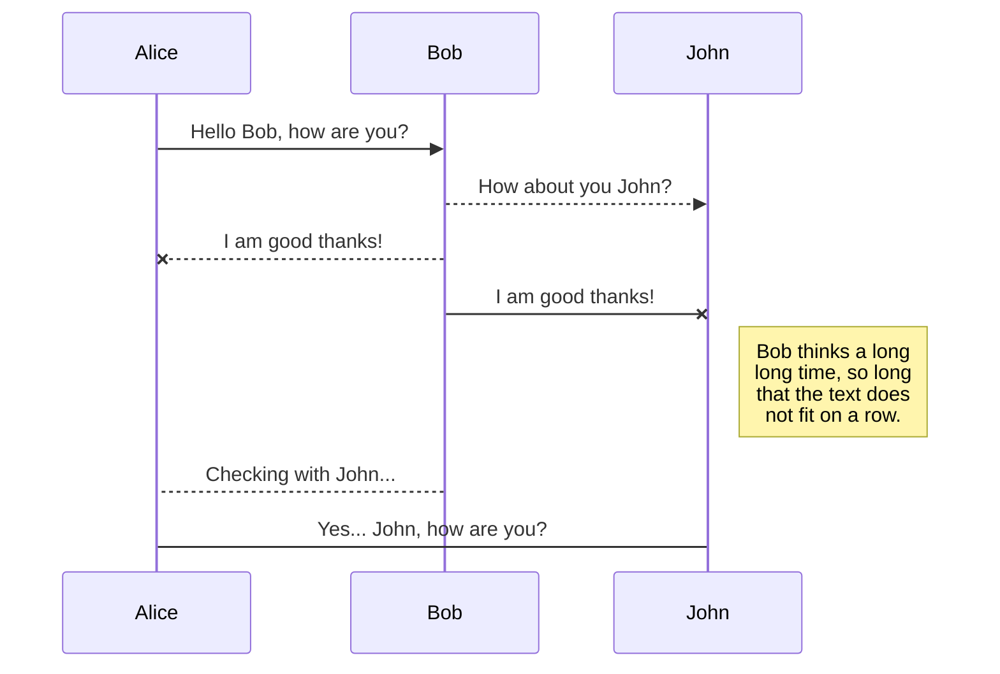
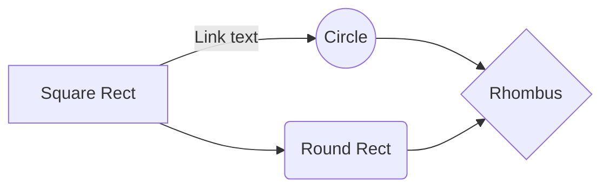

# Welcome to VNIT For All
Quick Note:
## Microsoft:
https://github.com/VNIT-for-All  
[Github Pages - Trang Này](https://vnit-for-all.github.io)  
↳ OverView 
↳ Repositories
  ↳ IT Talks 1102
  ↳ IT Leadership and Governance
  ↳ General IT Controls	
↳ Projects

## Google
[Google Groups](https://groups.google.com/g/vnitforall/about)
[Google Site](https://sites.google.com/view/vnit-for-all)
VNIT For All 
↳ Home
↳ Projects
  ↳ IT Talks 1102
  ↳ IT Leadership and Governance
  ↳ General IT Controls	
↳ Contacts

### Tài liệu nội bộ
[Google Drive VNIT for ALL](https://drive.google.com/drive/folders/1_C4BUP3GatJ8kU0_kp7_eN7UHs4E76A_).

## Meta
[Facebook Group](https://www.facebook.com/groups/vietnamittalks)

## Other 
| Slack & Gitbook vẫn đang đợi hết Trial rồi đánh giá tiếp. Github

> You can find more information about **StackEdit Tool**  [here](https://stackedit.io/app#).

## UML diagrams

You can render UML diagrams using [Mermaid](https://mermaidjs.github.io/). For example, this will produce a sequence diagram:

And this will produce a flow chart:

